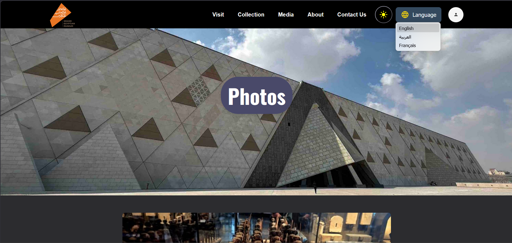
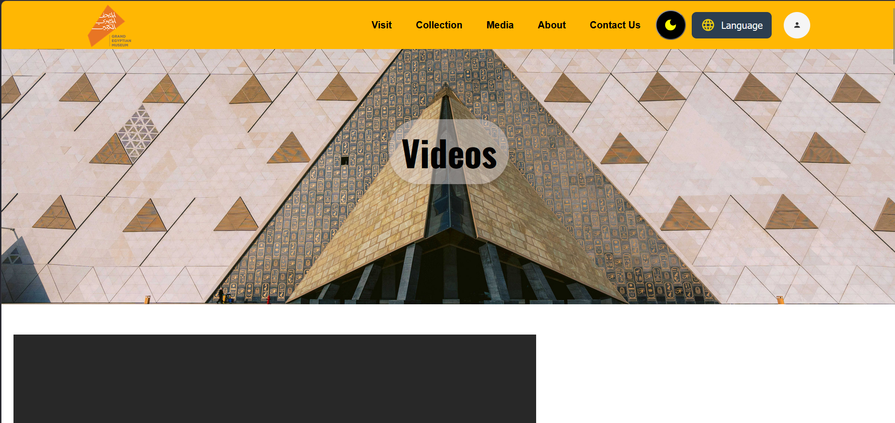

#  Museum Website (Pages Project)

A simple **museum-themed front-end project** built using HTML, CSS, and JavaScript.  
The project currently includes **Videos and Photos pages** with interactive UI features such as pagination, dark mode, and multilingual support.

---

##  Features

-  Photo gallery page  
-  Videos page with structured layout  
-  Multilingual support (Arabic / English / French)  
-  Pagination system for image gallery  
-  Saves user state using Local Storage  
-  Dark mode support  
-  Clean UI styling with CSS  
-  Vanilla JavaScript interactions  

---

##  Multilingual Support

The website supports multiple languages:

-  English  
-  Arabic  
-  French  

Content updates dynamically based on the selected language.

---

##  Pagination System (Photos Page)

The photo gallery includes a custom pagination system:

- Shows a limited number of items per page  
- Includes Previous / Next buttons  
- Page number navigation  
- Saves current page using `localStorage`  
- Restores last viewed page on refresh  

---

##  Dark Mode

Dark mode is implemented across the site:

- Toggle between light and dark themes  
- Saves preference using `localStorage`  
- Persists after page reload  

---

##  Videos Page

The videos page displays content in a structured layout:

- Organized video thumbnails  
- Clean responsive grid  
- Easy navigation between sections  

---

##  Built With

- HTML5  
- CSS3  
- JavaScript (Vanilla)

---

## 📸 Preview

### Photos Page


### Videos Page


---
##  Project Structure

```text
museum-website/
|-- pictures.html
|-- videos.html
|
|-- css/
|   |-- style.css
|   |-- photos.css
|   |-- videos.css
|   |-- darkmode.css
|
|-- js/
|   |-- pictures.js
|   |-- darkmode.js
|   |-- language.js
|
|-- images/
|   |-- website images used in pages
|
|-- assets/
|   |-- photos.png
|   |-- videos.png
|
|-- README.md
```

##  How to Run

1. Clone the repository:
```bash
git clone https://github.com/omarosama16/first-pages-website-museum.git
```
2. Open the project folder
3. Open `pictures.html` or `videos.html` in your browser
---
##  Project Purpose

This project was built to practice:

- Front-end page structuring  
- DOM manipulation with JavaScript  
- Pagination logic implementation  
- Dark mode toggle system  
- Multilingual UI handling  
- Responsive layout design  

---

##  Future Improvements

- Add a homepage (landing page)  
- Add smooth animations and transitions  
- Upgrade video page UI  
- Add search/filter for gallery  
- Convert into a full museum website project  

---

